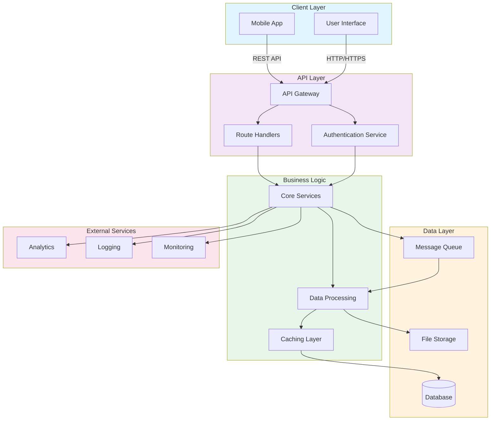

# animated-octo

train

## Architecture Overview

This diagram illustrates a modern, layered architecture with:
- **Client Layer**: User interfaces and applications
- **API Layer**: Gateway, authentication, and route management
- **Business Logic**: Core services, data processing, and caching
- **Data Layer**: Databases, message queues, and file storage
- **External Services**: Analytics, logging, and monitoring integration
